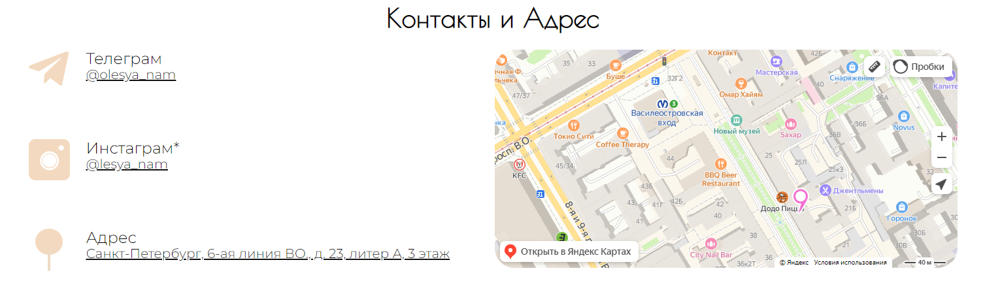
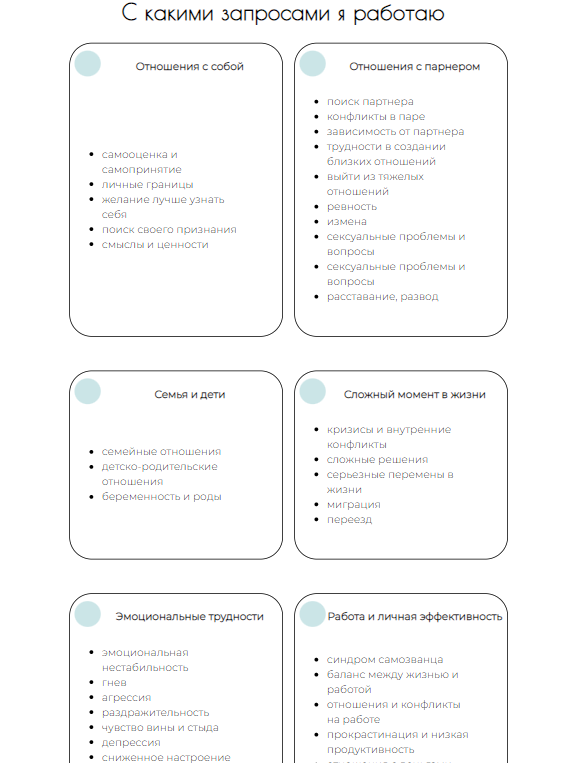

<h1 align="center">Проект "Лендинг для психолога"</h1>

---

## Функциональность веб-сайта
Данный лендинг удобен для пользователей - потенциальных клиентов. 
* На главной странице представлена информация о психологе.

* Наличие блока с запросами, по которым можно обратиться к специалисту.

* Возможность ознакомления со статьями специалиста, с переходом на новую страницу.

* Просмотр стоимости услуг на главной странице лендинга.

* Возможность записаться через заполнение формы, а также переход напрямую в социальные сети специалиста.

* Указан адрес специалиста, а также встроена карта с маршрутом.

* Веб-сайт адаптирован под различные размеры экрана.

  

---

## Использованные технологии

    

## Ссылка на лендинг

[Психолог Олеся Нам](https://serovakaterina.github.io/project-practice-2/)

---

## Разработчики лендинга

     

    
